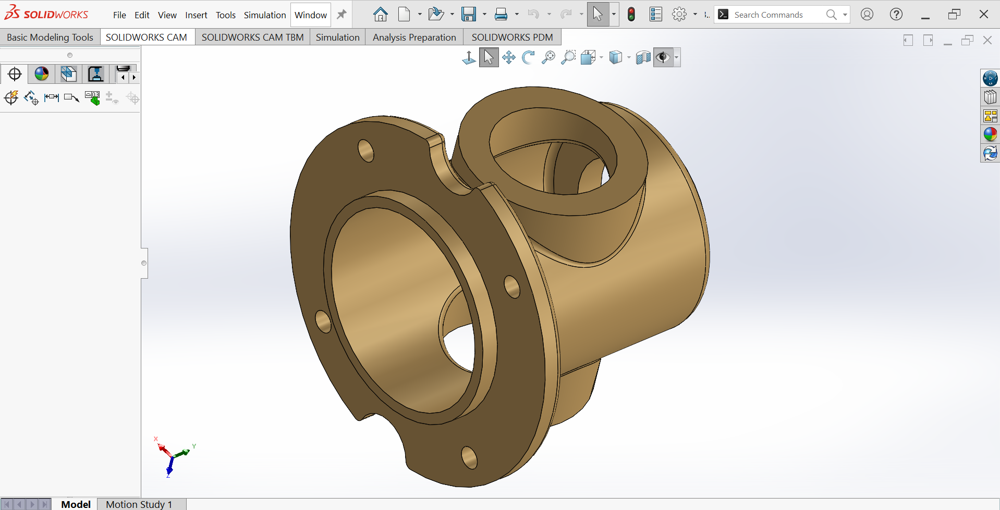
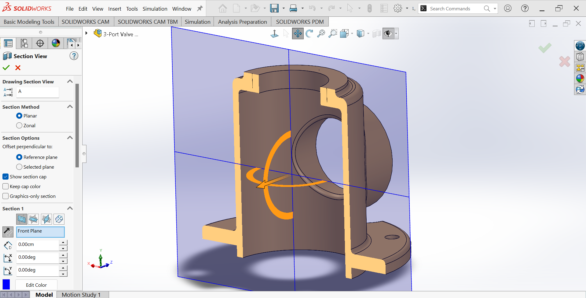
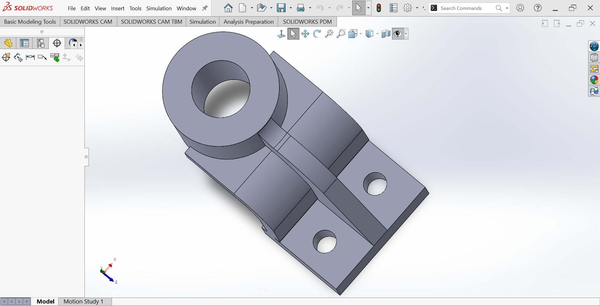

# SOLIDWORKS

# 3-Port Valve Body (Y-Valve Housing) — SolidWorks CAD Model

## Overview
This SolidWorks model represents a **cast 3-port valve body** (commonly called a Y-valve body, 3-way valve housing, or angled valve body) with:
- Central cylindrical chamber
- Three flanged ports arranged at 90° / 135° / 135° pattern
- Bolted flange connections
- Internal flow passages
- Designed with casting draft angles, fillets, and machining allowances in mind

The part is a classic educational CAD/CAM exercise demonstrating multi-view interpretation, revolved features, shelling, draft analysis, and preparation for casting + machining.

## Objective
Reproduce the valve body geometry from the provided multi-view technical drawing using SolidWorks tools, while maintaining dimensional accuracy, proper draft for cast iron, and realistic machining features (counterbores, tapped holes, fillets).

## Design Specifications
All dimensions in **millimeters (mm)**  
Material: **Cast Iron** (as specified)

| Feature                              | Value                  | Notes / Location                              |
|--------------------------------------|------------------------|-----------------------------------------------|
| Main body outer diameter (central)   | Ø100 mm                | Largest cylindrical section                   |
| Flange outer diameter (all ports)    | Ø160 mm (main), Ø135?  | Varies slightly per port                      |
| Port bore diameters                  | Ø65 mm, Ø54 mm         | Internal flow passages                        |
| Flange thickness                     | 10 mm                  | All three flanges                             |
| Central chamber length               | ≈120 mm                | Along main axis                               |
| Port center-to-center distances      | 110 mm, 125 mm         | Between port axes                             |
| Mounting holes                       | 4 × Ø10 mm per flange  | Clearance holes                               |
| Tapped holes (detail B)              | 4 × M4                 | Depth 8–10 mm, likely for cover/plug          |
| Counterbore (detail C)               | Ø8 mm × depth 8 mm     | For socket head cap screws?                   |
| Fillets (specified)                  | R5 mm, R3 mm           | R5 at junctions, 3 mm unspecified             |
| Chamfer on flange edges              | 1 × 45°                | All flange edges                              |
| Draft angle (implied)                | ~1–3°                  | Typical for sand casting                      |

## SolidWorks Tools & Features Demonstrated
- Multi-plane sketching & layout sketch
- Revolve (main body & ports)
- Extrude Boss/Base & Extrude Cut
- Shell (internal cavity creation)
- Fillet (constant & variable)
- Chamfer
- Hole Wizard (Ø10 clearance + M4 tapped)
- Circular Pattern (bolt holes)
- Mirror
- Draft analysis / check (recommended)
- Section views
- Appearance → Cast Iron material

## Design Features
- Symmetrical 3-port configuration (one inlet + two outlets at angle)
- Thick flanged connections for bolted assembly
- Generous fillets and radii suitable for casting
- Internal flow path transitions with smooth radii
- Machining allowances on sealing faces
- Multiple bolt circles for port covers or actuator mounting

## Models

---

## CAD Downloads

- Solidworks PRT
- DWG 
- eDrawings
- STEP AP214
- STL 

Download these files below

[Download 3-Port Valve Body.zip](./3-Port%20Valve%20Body.zip)

## Manufacturing Considerations
- Primary process: **Sand casting** (gray cast iron)
- Post-process: CNC machining of sealing faces, bores, threads
- Alternative: Investment casting (higher precision, smaller series)
- Core print locations needed for internal passages
- Machining stock: ≈1.5–3 mm on critical surfaces

Recommended material:
- **Gray Cast Iron GG25 / ASTM A48 Class 35B**

## Typical Applications
- Industrial 3-way valves (diverting / mixing)
- Hydraulic / pneumatic directional valves
- Low-pressure water / steam / oil systems
- Educational CAD/CAM projects
- Prototype valve bodies before production tooling

---

# Curved Offset Bearing Housing/ Pedestal Mount - SolidWorks Model

## Overview
This SolidWorks project models a robust **offset curved bearing support bracket** (also referred to as a curved pedestal, angled bearing housing, or heavy-duty offset mount).The component features:
- A large cylindrical boss/housing (Ø125 mm outer, thick wall)
- A strongly curved/radiused transition section
- A reinforced base flange with slotted mounting holes
- Multiple large fillet radii for stress distribution
- Thick material sections suitable for cast iron, steel, or heavy-duty aluminum

Designed for applications requiring high load capacity, vibration resistance, and offset shaft/bearing mounting.

## Objective
Accurately recreate the geometry from the provided technical drawing using SolidWorks sketching, extrude, revolve, sweep, fillet, and hole/wizard tools — while maintaining all critical dimensions and manufacturing-friendly features.

## Design Specifications
All dimensions in **millimeters (mm)**

| Feature                              | Value              | Notes / Location                              |
|--------------------------------------|--------------------|-----------------------------------------------|
| Base flange overall size             | 92 × 68 mm         | Rectangular base                              |
| Base thickness                       | 18 mm              | Main mounting pad                             |
| Mounting slot pattern                | 4 slots            | Two pairs (20×16 mm & similar)                |
| Central boss outer diameter          | Ø125 mm            | Main cylindrical housing                      |
| Boss height (above base curve)       | ~55 mm             | Tallest point                                 |
| Curved section outer radius          | R42 mm             | Main transition arc                           |
| Curved section inner radius          | R18 mm             | Inner relief radius                           |
| Sweep/rib thickness                  | 12 mm              | Web/rib along curve                           |
| Large transition fillets             | R42, R18, R12      | Multiple radii at junctions                   |
| Base-to-curve fillet                 | R5 mm              | Small stress-relief fillet                    |
| Total height (approx.)               | 120 mm             | From base bottom to top of boss               |
| Total length (along curve)           | ~125–130 mm        | Centerline path                               |
| Material thickness (walls)           | 10–18 mm           | Varies by section                             |

## SolidWorks Tools & Features Demonstrated
- 2D Sketching → Line, Arc (3-point, tangent), Circle, Slot
- Sketch Relations → Tangent, Coincident, Symmetric, Horizontal/Vertical
- Features → Extrude Boss/Base, Extrude Cut, Revolve, Sweep (with guide curves if needed)
- Fillet → Variable radius (R5, R12, R18, R42)
- Hole Wizard → For potential bearing mounting (not shown in drawing)
- Mirror / Symmetry
- Shell (if internal wall thickness is modeled)
- Chamfer (small edge breaks)
- Appearance / Material assignment (cast iron / steel look)

## Design Features
- Thick base flange with multiple mounting slots for flexible installation
- Large Ø125 mm cylindrical boss suitable for bearing housing or shaft support
- Generously radiused curved transition → excellent stress flow & fatigue resistance
- Reinforced ribbing along the curve for torsional & bending stiffness
- No sharp corners → suitable for casting, forging, or heavy machining
- Symmetrical about the vertical centerline

## Models

---

## CAD Downloads

- Solidworks PRT
- DWG 
- eDrawings
- STEP AP214
- STL 

Download these files below

[Download Bearing Housing.zip](./Bearing%20Housing.zip)

## Manufacturing Considerations
Recommended processes:
- Sand casting (gray iron, ductile iron) + machining
- Steel fabrication (flame/plasma cut base + rolled/welded tube + machining)
- CNC milling from solid billet (steel or aluminum)
- Investment casting for smaller series (stainless)

Typical materials:
- EN-GJL-250 (gray cast iron)
- EN-GJS-400-15 (ductile iron)
- S355J2 / AISI 1045 steel
- 7075-T6 aluminum (lighter applications)

## Typical Applications
- Conveyor roller / idler supports
- Agricultural machinery pivot mounts
- Industrial fan / blower housings
- Heavy equipment linkage supports
- Machine tool structural elements
- Crane / hoist bearing pedestals

---
