# SOLIDWORKS

# 3-Port Valve Body (Y-Valve Housing) — SolidWorks CAD Model.

## Overview
This SolidWorks model represents a **cast 3-port valve body** (commonly called a Y-valve body, 3-way valve housing, or angled valve body) with:
- Central cylindrical chamber
- Three flanged ports arranged at 90° / 135° / 135° pattern
- Bolted flange connections
- Internal flow passages
- Designed with casting draft angles, fillets, and machining allowances in mind

The part is a classic educational CAD/CAM exercise demonstrating multi-view interpretation, revolved features, shelling, draft analysis, and preparation for casting + machining.

## Objective
Reproduce the valve body geometry from the provided multi-view technical drawing using SolidWorks tools, while maintaining dimensional accuracy, proper draft for cast iron, and realistic machining features (counterbores, tapped holes, fillets).

## Design Specifications
All dimensions in **millimeters (mm)**  
Material: **Cast Iron** (as specified)

| Feature                              | Value                  | Notes / Location                              |
|--------------------------------------|------------------------|-----------------------------------------------|
| Main body outer diameter (central)   | Ø100 mm                | Largest cylindrical section                   |
| Flange outer diameter (all ports)    | Ø160 mm (main), Ø135?  | Varies slightly per port                      |
| Port bore diameters                  | Ø65 mm, Ø54 mm         | Internal flow passages                        |
| Flange thickness                     | 10 mm                  | All three flanges                             |
| Central chamber length               | ≈120 mm                | Along main axis                               |
| Port center-to-center distances      | 110 mm, 125 mm         | Between port axes                             |
| Mounting holes                       | 4 × Ø10 mm per flange  | Clearance holes                               |
| Tapped holes (detail B)              | 4 × M4                 | Depth 8–10 mm, likely for cover/plug          |
| Counterbore (detail C)               | Ø8 mm × depth 8 mm     | For socket head cap screws?                   |
| Fillets (specified)                  | R5 mm, R3 mm           | R5 at junctions, 3 mm unspecified             |
| Chamfer on flange edges              | 1 × 45°                | All flange edges                              |
| Draft angle (implied)                | ~1–3°                  | Typical for sand casting                      |

## SolidWorks Tools & Features Demonstrated
- Multi-plane sketching & layout sketch
- Revolve (main body & ports)
- Extrude Boss/Base & Extrude Cut
- Shell (internal cavity creation)
- Fillet (constant & variable)
- Chamfer
- Hole Wizard (Ø10 clearance + M4 tapped)
- Circular Pattern (bolt holes)
- Mirror
- Draft analysis / check (recommended)
- Section views
- Appearance → Cast Iron material

## Design Features
- Symmetrical 3-port configuration (one inlet + two outlets at angle)
- Thick flanged connections for bolted assembly
- Generous fillets and radii suitable for casting
- Internal flow path transitions with smooth radii
- Machining allowances on sealing faces
- Multiple bolt circles for port covers or actuator mounting

## Models

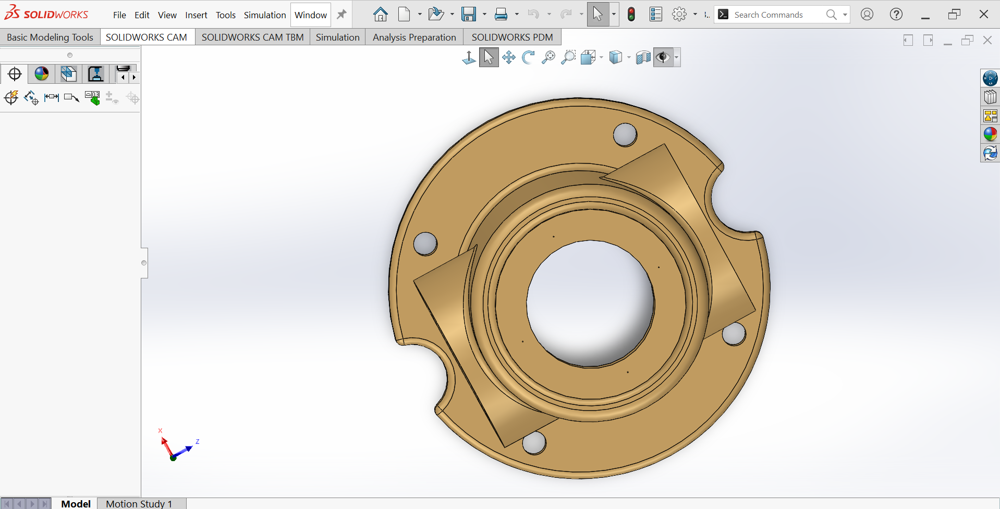

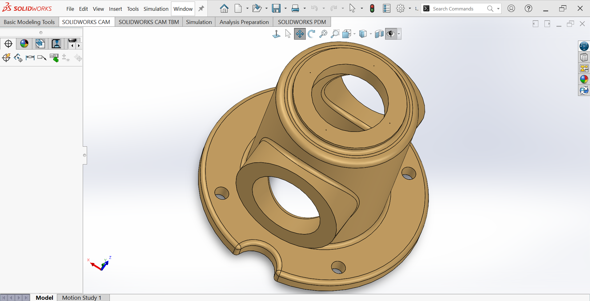

---

## CAD Downloads

- SolidWorks PRT  
- DWG  
- eDrawings  
- STEP AP214  
- STL  

Download these files below

[Download 3-Port Valve Body.zip](./solidworksassets/3-Port%20Valve%20Body.zip)

## Manufacturing Considerations
- Primary process: **Sand casting** (gray cast iron)
- Post-process: CNC machining of sealing faces, bores, threads
- Alternative: Investment casting (higher precision, smaller series)
- Core print locations needed for internal passages
- Machining stock: ≈1.5–3 mm on critical surfaces

Recommended material:
- **Gray Cast Iron GG25 / ASTM A48 Class 35B**

## Typical Applications
- Industrial 3-way valves (diverting / mixing)
- Hydraulic / pneumatic directional valves
- Low-pressure water / steam / oil systems
- Educational CAD/CAM projects
- Prototype valve bodies before production tooling

---

# Stepped Transmission Shaft with Pulley & Flange — SolidWorks.

## Overview
This SolidWorks model represents a **multi-diameter stepped shaft** designed for power transmission applications. It features:
- Multiple precision bearing journals
- A wide V-belt pulley groove
- A large mounting flange with bolt circle
- Threaded end (M20)
- Several chamfers, fillets, and relief grooves

The component is a classic mechanical engineering CAD exercise demonstrating **revolved features**, **diameter steps**, **grooves**, **fillets/chamfers**, and **section views interpretation**.

Total length (end to end): **323 mm**

## Design Specifications
All dimensions in **millimeters (mm)**

| Feature                          | Diameter / Size       | Length / Width       | Notes / Location                          |
|-------------------------------|------------------------|----------------------|--------------------------------------------|
| Total shaft length            | —                     | 323 mm              | Overall                                       |
| Threaded end                  | M20                   | —                   | Leftmost end                                  |
| Smallest journal (left)       | Ø35                   | 30 mm               | After thread relief                           |
| Next step                     | Ø45                   | 22 mm               | —                                             |
| Flange diameter               | Ø85                   | 10 mm thick         | 6 × Ø8 mm bolt holes on Ø52 mm PCD            |
| Pulley groove (V-belt)        | Bottom Ø48            | Groove width ≈24 mm | Large central pulley section                  |
| Major pulley diameter         | Ø102 / Ø70            | —                   | Outer / inner cone diameters                  |
| Bearing journal (right side)  | Ø48                   | Multiple segments   | Several precision Ø48 mm sections             |
| Large relief / transition     | Ø66                   | 15 + 15 mm          | Near right end                                |
| End chamfer                   | 3 × 45°               | —                   | Rightmost end                                 |
| Fillets (various)             | R1, R2, R3, R10       | —                   | Stress relief at diameter changes             |

## SolidWorks Features & Techniques Demonstrated
- Revolve (main body from centerline sketch)
- Sketch with multiple diameter steps
- Chamfer (multiple sizes & angles)
- Fillet (variable radii: R1–R10)
- Groove / Cut (pulley V-groove)
- Hole / Circular Pattern (flange bolt holes)
- Section View (for verification)
- Dimensioning & relations in sketch
- Appearance assignment (steel / machined look)

## Models

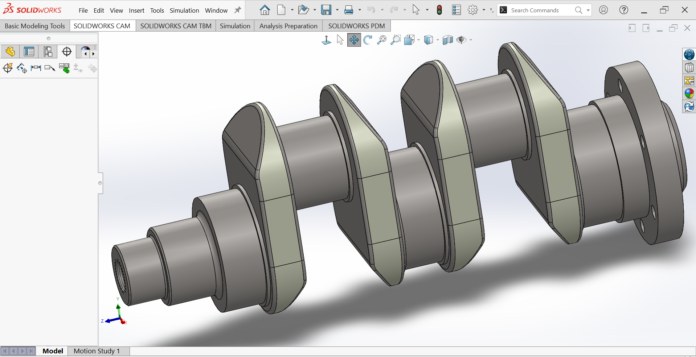
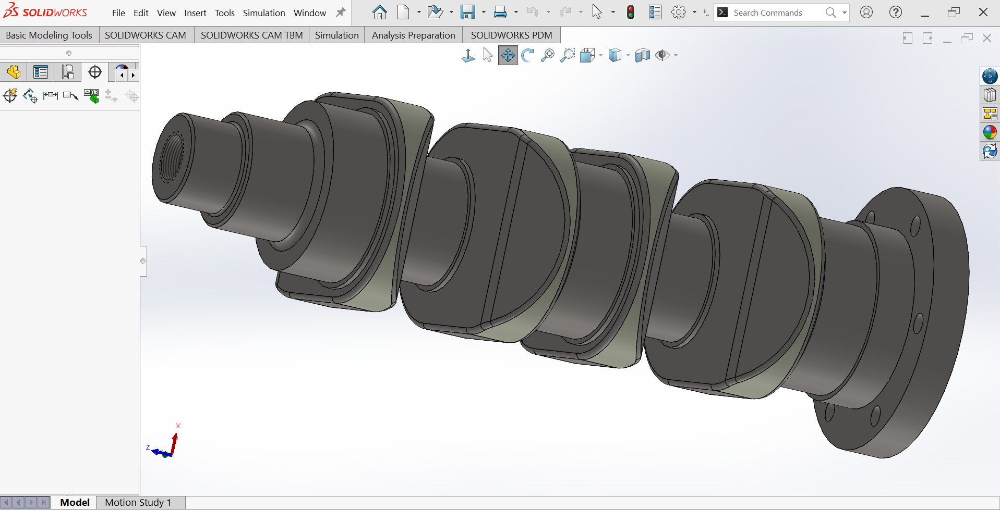
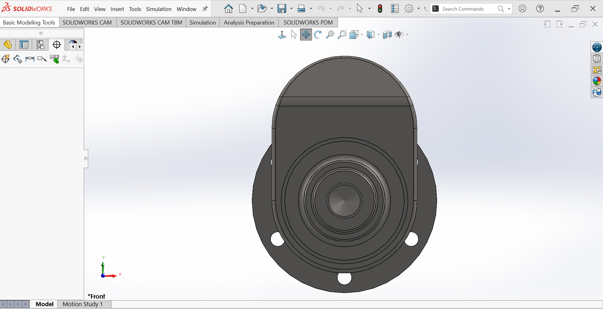
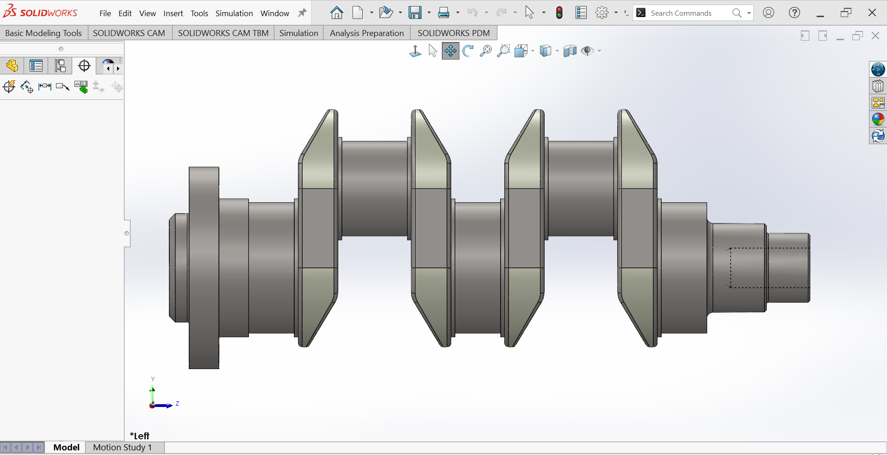
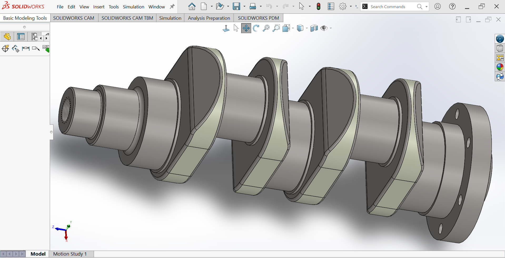

---

## CAD Downloads

- SolidWorks PRT  
- DWG  
- eDrawings  
- STEP AP214  
- STL  

Download these files below

[Download Crankshaft.zip](./solidworksassets/Crankshaft.zip)

## Manufacturing Considerations
Recommended processes:
- CNC turning (main profile & journals)
- Milling or drilling for flange bolt holes
- Thread rolling or single-point threading for M20
- Possible heat treatment (if high torque)

Typical material:
- C45 / 1045 carbon steel
- 42CrMo4 (higher strength)
- Stainless steel AISI 304 / 316 (corrosion-resistant version)

## Typical Applications
- Belt-drive transmission shafts
- Lathe headstock / intermediate shafts
- Pump / compressor drive shafts
- Gearbox input/output shafts
- Agricultural machinery power take-off (PTO) shafts
- Educational mechanical design & manufacturing projects

---

# 6-Blade Axial Fan / Propeller — SolidWorks CAD Model.

## Overview
This SolidWorks project demonstrates advanced **surface modeling techniques** to create a realistic **4-blade axial fan / propeller** suitable for fans, drones, marine propellers, or ventilation systems. The model is built almost entirely using **surfaces** (not solid features for the blades), showcasing a typical industrial workflow for complex, free-form geometry.

## Learning Objectives / Techniques Demonstrated
1. Extruded Boss/Base → central hub
2. Chamfer → edge preparation on hub
3. Plane creation → reference geometry for loft
4. Lofted Surface → main blade geometry (with guide curves)
5. Trim Surface → precise blade shaping and root cleanup
6. Thicken → convert surfaces to solid bodies with uniform thickness
7. Circular Pattern → duplicate blades (6× symmetry)
8. Appearance / Material assignment → realistic rendering

## Project Workflow Summary
| Step | Feature                          | Purpose                                      |
|------|----------------------------------|----------------------------------------------|
| 1    | Extruded Boss/Base               | Create central hub / boss                    |
| 2    | Chamfer                          | Break sharp edges on hub                     |
| 3    | Plane (offset / angled)          | Define loft sections and orientation         |
| 4    | Lofted Surface                   | Generate smooth, curved blade surface        |
| 5    | Trim Surface                     | Cut unwanted surface areas, define blade tips & roots |
| 6    | Thicken                          | Give blade surface thickness (solid body)    |
| 7    | Circular Pattern (6×)            | Replicate blade around axis                  |
| 8    | Appearance                       | Apply plastic/metal look + color             |

## Model Specifications
- Number of blades: **4**
- Blade type: **Swept / lofted airfoil-style**
- Hub geometry: Cylindrical with chamfered edges
- Blade thickness: Uniform (via Thicken feature)
- Symmetry: 90° rotational
- Modeling method: Primarily **Surface** → Thicken → Solid
- Software: **SolidWorks** (Surfacing & Part environment)

## Models

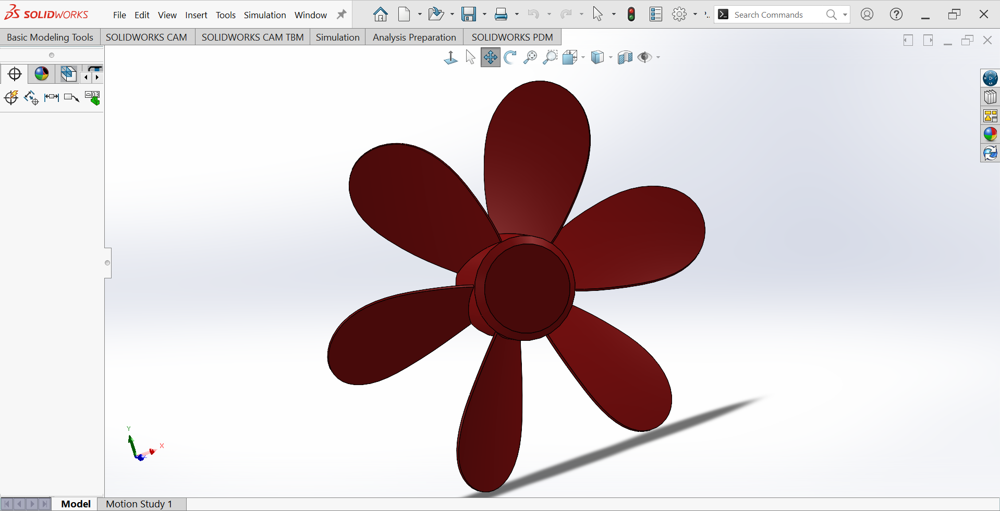

---

## CAD Downloads

- SolidWorks PRT  
- DWG  
- eDrawings  
- STEP AP214  
- STL  

Download these files below

[Download 6-Blade Axial Fan.zip](./solidworksassets/6-Blade%20Axial%20Fan.zip)

## SolidWorks Features & Tools Used
- **Reference Geometry** → Plane, Axis
- **Surfaces** → Lofted Surface, Trim Surface, Boundary Surface (possible)
- **Direct Editing** → Thicken, Delete Face (if needed)
- **Pattern** → Circular Pattern (feature or body)
- **Chamfer** & **Fillet** (hub preparation)
- **Appearance** → Plastic (blue), metal (hub), realistic rendering settings

## Applications
- Computer cooling fans
- Drone / UAV propellers
- HVAC axial impellers
- Small boat / RC boat propellers
- Educational surfacing & industrial design exercises

---

# Curved Offset Bearing Housing/ Pedestal Mount - SolidWorks Model.

## Overview
This SolidWorks project models a robust **offset curved bearing support bracket** (also referred to as a curved pedestal, angled bearing housing, or heavy-duty offset mount).The component features:
- A large cylindrical boss/housing (Ø125 mm outer, thick wall)
- A strongly curved/radiused transition section
- A reinforced base flange with slotted mounting holes
- Multiple large fillet radii for stress distribution
- Thick material sections suitable for cast iron, steel, or heavy-duty aluminum

Designed for applications requiring high load capacity, vibration resistance, and offset shaft/bearing mounting.

## Objective
Accurately recreate the geometry from the provided technical drawing using SolidWorks sketching, extrude, revolve, sweep, fillet, and hole/wizard tools — while maintaining all critical dimensions and manufacturing-friendly features.

## Design Specifications
All dimensions in **millimeters (mm)**

| Feature                              | Value              | Notes / Location                              |
|--------------------------------------|--------------------|-----------------------------------------------|
| Base flange overall size             | 92 × 68 mm         | Rectangular base                              |
| Base thickness                       | 18 mm              | Main mounting pad                             |
| Mounting slot pattern                | 4 slots            | Two pairs (20×16 mm & similar)                |
| Central boss outer diameter          | Ø125 mm            | Main cylindrical housing                      |
| Boss height (above base curve)       | ~55 mm             | Tallest point                                 |
| Curved section outer radius          | R42 mm             | Main transition arc                           |
| Curved section inner radius          | R18 mm             | Inner relief radius                           |
| Sweep/rib thickness                  | 12 mm              | Web/rib along curve                           |
| Large transition fillets             | R42, R18, R12      | Multiple radii at junctions                   |
| Base-to-curve fillet                 | R5 mm              | Small stress-relief fillet                    |
| Total height (approx.)               | 120 mm             | From base bottom to top of boss               |
| Total length (along curve)           | ~125–130 mm        | Centerline path                               |
| Material thickness (walls)           | 10–18 mm           | Varies by section                             |

## SolidWorks Tools & Features Demonstrated
- 2D Sketching → Line, Arc (3-point, tangent), Circle, Slot
- Sketch Relations → Tangent, Coincident, Symmetric, Horizontal/Vertical
- Features → Extrude Boss/Base, Extrude Cut, Revolve, Sweep (with guide curves if needed)
- Fillet → Variable radius (R5, R12, R18, R42)
- Hole Wizard → For potential bearing mounting (not shown in drawing)
- Mirror / Symmetry
- Shell (if internal wall thickness is modeled)
- Chamfer (small edge breaks)
- Appearance / Material assignment (cast iron / steel look)

## Design Features
- Thick base flange with multiple mounting slots for flexible installation
- Large Ø125 mm cylindrical boss suitable for bearing housing or shaft support
- Generously radiused curved transition → excellent stress flow & fatigue resistance
- Reinforced ribbing along the curve for torsional & bending stiffness
- No sharp corners → suitable for casting, forging, or heavy machining
- Symmetrical about the vertical centerline

## Models

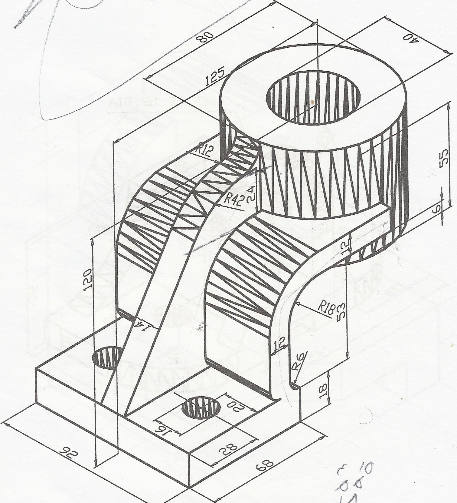
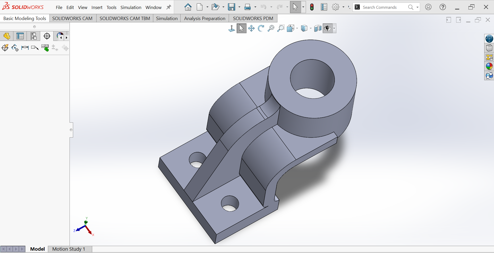
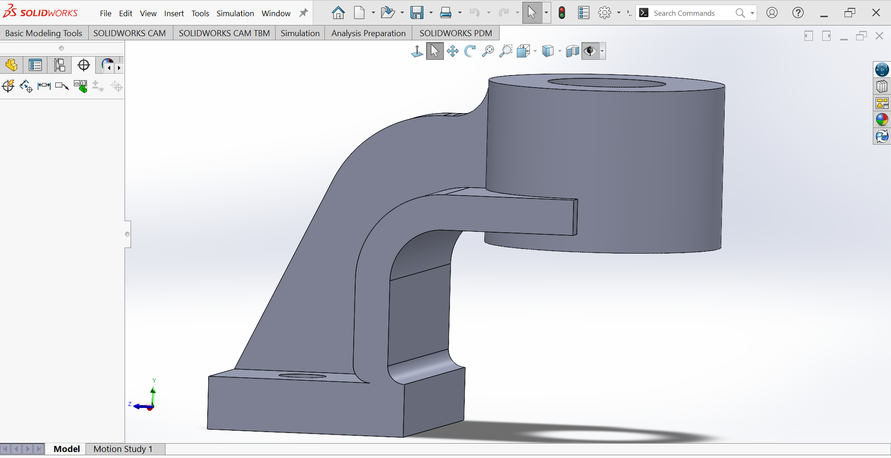

---

## CAD Downloads

- SolidWorks PRT  
- DWG  
- eDrawings  
- STEP AP214  
- STL  

Download these files below

[Download Bearing Housing.zip](./solidworksassets/Bearing%20Housing.zip)

## Manufacturing Considerations
Recommended processes:
- Sand casting (gray iron, ductile iron) + machining
- Steel fabrication (flame/plasma cut base + rolled/welded tube + machining)
- CNC milling from solid billet (steel or aluminum)
- Investment casting for smaller series (stainless)

Typical materials:
- EN-GJL-250 (gray cast iron)
- EN-GJS-400-15 (ductile iron)
- S355J2 / AISI 1045 steel
- 7075-T6 aluminum (lighter applications)

## Typical Applications
- Conveyor roller / idler supports
- Agricultural machinery pivot mounts
- Industrial fan / blower housings
- Heavy equipment linkage supports
- Machine tool structural elements
- Crane / hoist bearing pedestals

---

# Connecting Rod (Conrod) – Offset Big End – SolidWorks Model.

## Overview
This SolidWorks model represents a typical **offset connecting rod** used in single-cylinder engines, compressors, or small mechanisms.

The design features:
- Large (big end) journal Ø60 mm – typically for crankshaft
- Small end journal Ø20 mm – typically for piston pin / wrist pin
- Strongly offset layout (non-inline big & small ends)
- I-beam style web with generous fillets
- Thicker mid-section for strength
- Machined reliefs and chamfers

It is a very common student / training exercise for practicing:
- complex profile sketching
- mirrored / symmetric extrusions
- fillet / chamfer management
- revolved cuts (for journals)

## Design Specifications
All dimensions in **millimeters (mm)**  
Material thickness (web): **8 mm** (constant in main body)

| Feature                     | Dimension              | Notes                                      |
|-----------------------------|------------------------|--------------------------------------------|
| Big end journal (outside)   | Ø60 mm                 | Crankshaft side                            |
| Big end journal (inside)    | Ø30 mm                 | Bearing / bushing seat                     |
| Small end journal (outside) | Ø42 mm                 | Piston pin side                            |
| Small end journal (inside)  | Ø20 mm                 | Wrist pin bore                             |
| Center-to-center distance   | 105 mm                 | Overall length between bore centers        |
| Offset (lateral)            | ≈33 mm                 | Vertical offset between bore centerlines   |
| Web / beam thickness        | 8 mm                   | Main I-section thickness                   |
| Maximum width (big end)     | ≈80 mm                 | Measured across big end boss               |
| Fillet – main outer         | R60 mm                 | Large radius outer contour                 |
| Fillet – inner relief       | R (large curve)        | Concave inner radius                       |
| Fillet – boss junctions     | 4 × R8 mm              | Transition to journals                     |
| Edge fillets (side)         | R2 mm                  | All around the perimeter                   |
| Boss thickness (big end)    | 20 mm                  | Thicker at bearing area                    |
| Boss thickness (small end)  | 20 mm                  | Symmetric                                  |

## Models

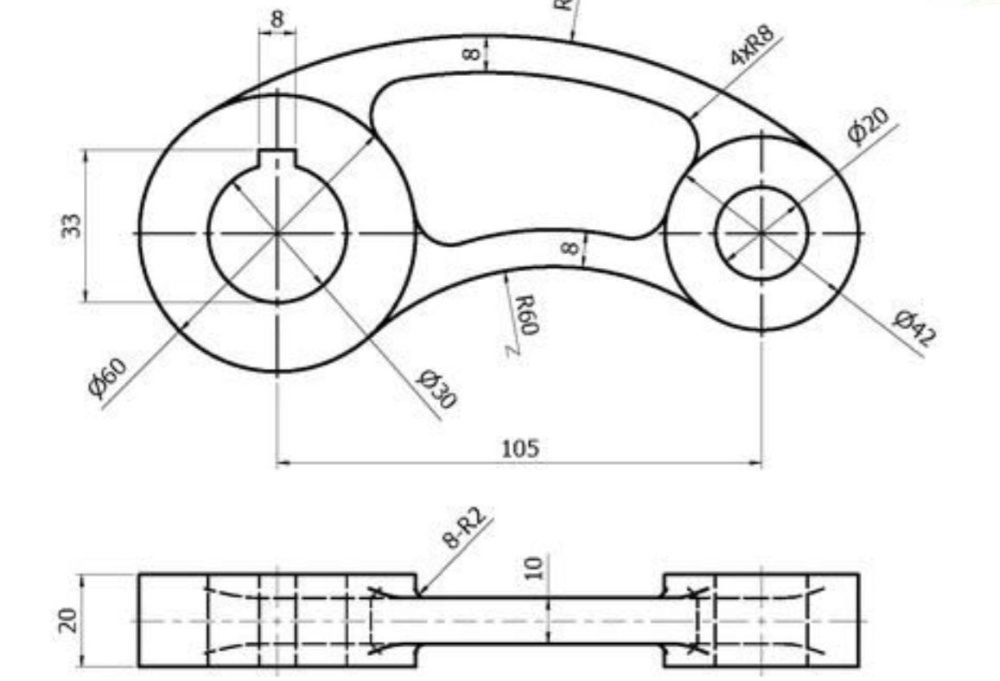
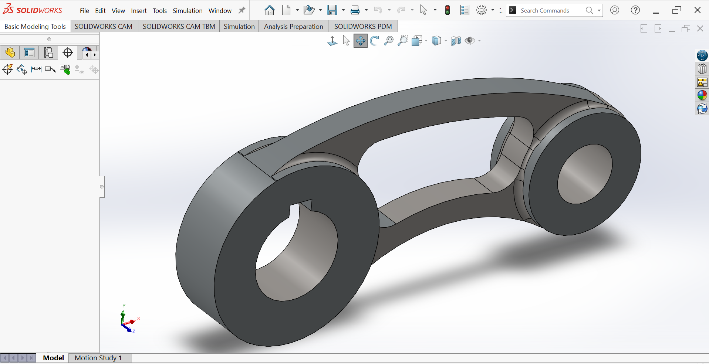

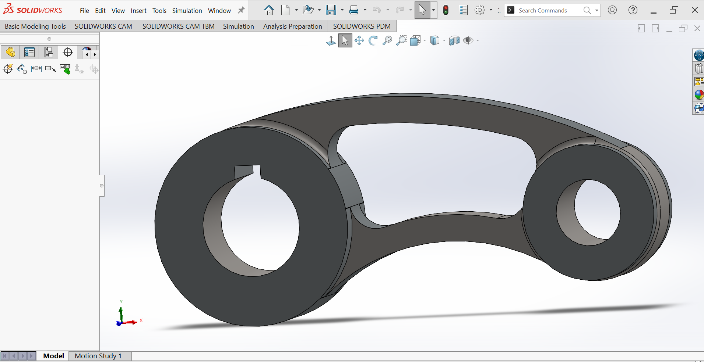

---

## CAD Downloads

- SolidWorks PRT  
- DWG  
- eDrawings  
- STEP AP214  
- STL  

Download these files below

[Download Conrod.zip](./solidworksassets/Conrod.zip)

## SolidWorks Techniques Demonstrated
- Complex closed profile sketch (outer contour + inner cutout)
- Mirror entities / symmetry about centerline
- Extrude Boss/Base (main body)
- Extrude Cut (both journal bores)
- Revolved Cut or Boss (optional for journal profiling)
- Multiple Fillet features (different radii applied in sequence)
- Chamfer (small edge breaks)
- Appearance assignment (steel, anodized, or cast look)
- Section View & Measure tool validation

## Manufacturing Considerations
Typical real-world production:
- Forged steel (C70S6BY, 42CrMo4, micro-alloyed steel) → machining
- Powder metallurgy (for lower-performance applications)
- CNC machining from billet (prototypes / racing conrods)
- Shot peening + fracture splitting (modern high-volume rods)

## Typical Applications
- Small gasoline / diesel engines (motorcycles, lawnmowers, generators)
- Air compressors
- Model engines / RC engines
- Educational CAD & mechanical design training
- Mechanism analysis & motion studies

